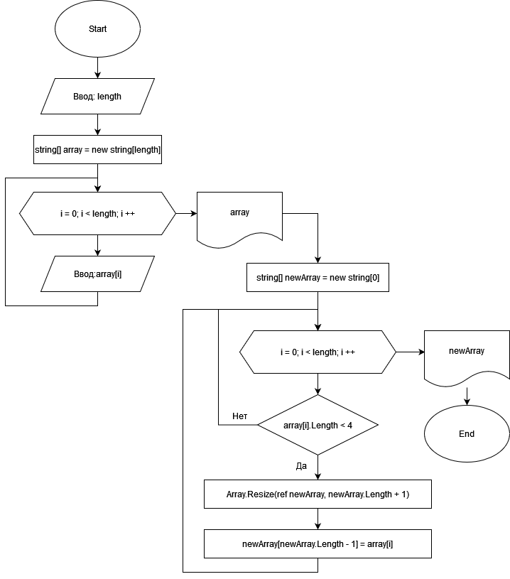

## Описание работы программы

**Задача:** *Написать программу, которая из имеющегося массива строк формирует массив строк, длина которых меньше либо равна 3 символа. Первоначальный массив ввести с клавиатуры.*

### Релизацию данной задачи можно разбить на следующие методы:

* Метод создания и заполнения массива
* Метод отбора элементов массива, соответствующих требованиям
* Метод вывода на экран первоначального и итогового массива

**Метод создания и заполнения массива** 

Размер массива вводится пользователем (для преобразования в целочисленный тип данных используется метод ReadInt). Затем согласно размеру (с помощью цикла for) пользователь поочередно вводит элементы массива. Метод возвращает строковый массив.

**Метод отбора элементов**

Метод принимает предварительно созданный массив и создает новый с нулевым размером. Затем в цикле выполняется проверка каждой строки первоначального массива на выполнение условия "Length < 4".
В случае, если условие выполняется, размер нового массива увеличивается на 1, и последним элементом в него помещается проверяемая строка из первого массива. Метод возвращает строковый массив, состоящий из подходящих элементов первого массива.

**Метод вывода на экран массива**

Метод принимает массив и выводит его в терминал в удобном и понятном виде. Используется системный метод string.Join, объединяющий элементы указанного массива в строку с указанным разделителем.

### Блок-схема описанного выше алгоритма:
    

